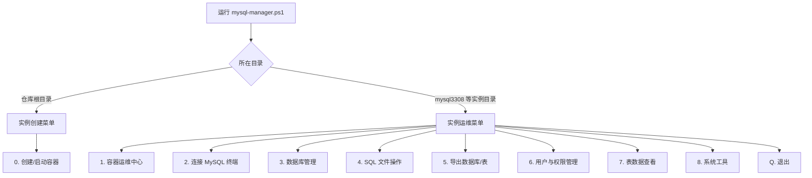
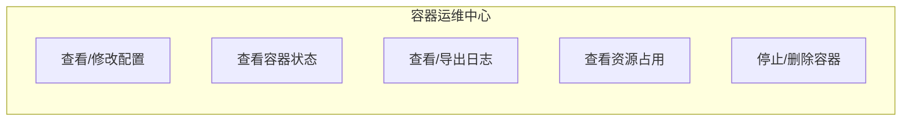
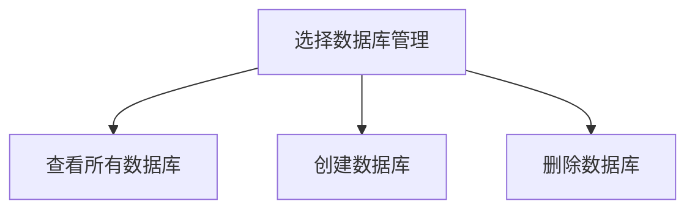
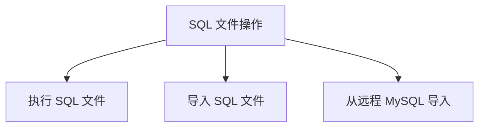
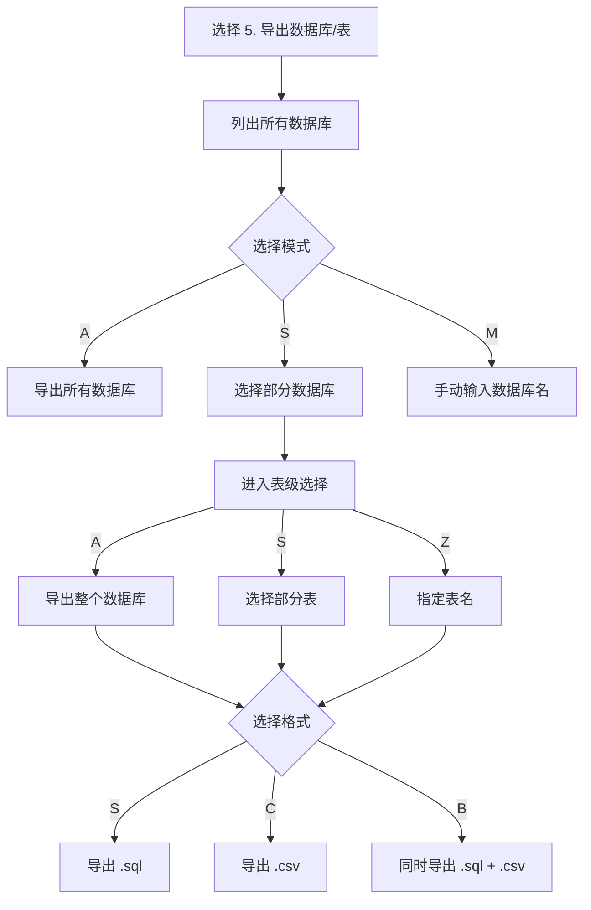

# Docker-Service-Manager
一个基于 PowerShell 的 Docker 本地服务管理工具集。目前内置 **MySQL 单实例管理器**，支持容器创建、运维、备份、恢复、用户权限、远程导入、监控诊断等完整生命周期管理。
[](https://www.docker.com/)

**零依赖客户端**：所有 MySQL 操作通过 `docker exec` 调用容器内工具完成，无需在宿主机安装 MySQL
**安全凭据**：root 密码通过 DPAPI 加密保存到项目目录 `.mysqlcred`，脚本中不记录明文密码

## 运行方式

### 方式一：创建新实例

在仓库根目录右键运行 `mysql-manager.ps1`，选择 `[0] 创建/启动 MySQL 容器`。

### 方式二：管理已有实例

进入实例目录（如 `mysql3308`），运行该目录下的 `mysql-manager.ps1`，自动进入运维菜单。

### 方式三：命令行运行

```powershell
# 创建新实例
.\mysql-manager.ps1

# 管理已有实例
cd mysql3308
.\mysql-manager.ps1
```

> 提示：右键运行后窗口会在操作结束后暂停，避免一闪而过。
>
## 主菜单架构



---

## 功能模块

### 1. 容器运维中心



### 2. 数据库管理



### 3. SQL 文件操作



### 4. 导出流程



---

## 
